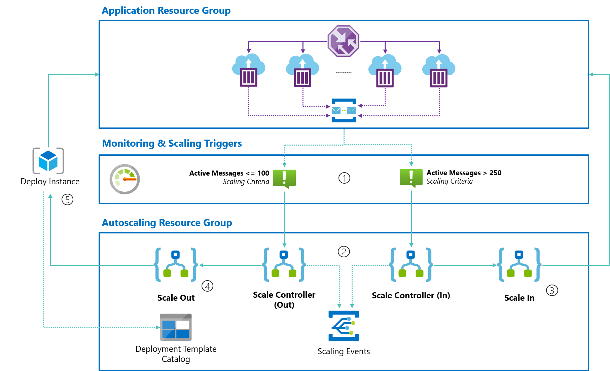

# Autoscale Azure Container Instance with Azure Serverless

A proof-of-concept on how you can autoscale Azure Container Instance container groups in a resource group by using with Azure Serverless as a scaling infrastructure.

Read more about it in [this blog post](https://blog.tomkerkhove.be/2021/01/02/autoscaling-azure-container-instances-with-azure-serverless/).

## How does it work?

1. **Azure Monitor Alerts are used to monitor scaling criteria** and will trigger scale controller to make scaling decisions. Given they don't automatically mitigate they will keep on sending notifications until the scale criteria is no longer applicable.
2. **Scale controllers evaluate the current amount of replicas** when they are triggered and take max/min replicas into account. In case scaling actions have to occur, they trigger a dedicated workflow to make it so and wait until it completes to trigger a scaling event.
3. **Scale In** workflow queries the current amount of Azure Container Instance container group in the resource group and delete the first one.
4. **Scale Out** workflow will load a deployment template provided in Azure Storage and replace it with the required information for the new container group. After that, it fully relies on Azure Resource Manager (ARM).
5. **Azure Resource Manager provisions a new Azure Container Instance container group** based on the provided template in Azure Storage. When required, it can automatically add an endpoint in Azure Traffic Manager to expose it to clients.

Here's a high-level overview:

## How do I deploy it?

You can easily deploy the POC:

1. Create a workload ARM template that will be used to spin up new instances.
    - The parameters file should have `NAME_PLACEHOLDER` as value for the container group name which will be replaced at runtime.
    - Use one of our sample workloads from [`deploy/app`](deploy/app/README.md)
2. Deploy our autoscaler infrastructure ARM template (`deploy/autoscaler/autoscaler-infrastructure.json`)
3. Upload your workload ARM template & parameters file to the `templates` blob container of the created storage account
4. Deploy our autoscaler runtime ARM template (`deploy/autoscaler/autoscaler-runtime.json`)
5. Authenticate the Azure Container Instance & ARM API connection that was created
6. Scale!

## Caveats

All good things come with caveats:

- **Our current scaling strategy is linear** which is a good starting point, but in some scenarios, you’d rather prefer to add multiple instances per scaling action to more aggressively handle spikes. That said, you could very easily implement this by updating the scaling logic of the Scale Controller(s)
- Currently, **all ARM template parameters are stored in Azure Storage and are not being replaced**. This means that **sensitive parameters, such as secrets, are stored in the Deployment Template Catalog**.
- **While you can scale to 0 instances, it does not ensure that all your queues are empty**. This means you’ve potentially scaled to 0 instances, while there are still <100 messages. This can easily be implemented by extending the Scale Controller(s).
- **All events to Azure Event Grid are using the Event Grid scheme but I recommend using CloudEvents when possible**. Today, Azure Logic Apps does not support it but you can easily send an HTTP request to an Azure Function and use code to send the event yourself.

Keep in mind that this is a **POC and not suitable for production**. For example, **our runtime does not provide alerts while you should have them** to make sure you are scaling as it should and not relying on something that is broken.
